# **Nand**
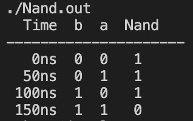

# **Not**
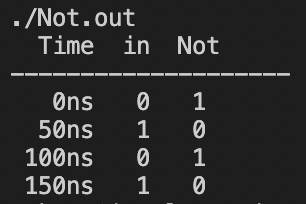

# **And**
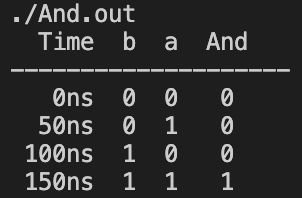

# **Or**
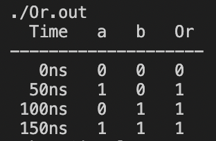

# **Xor**
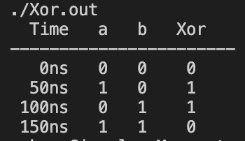

# **Mux**
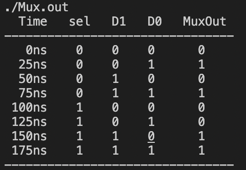

# **DMux**
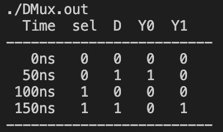

# **And16**
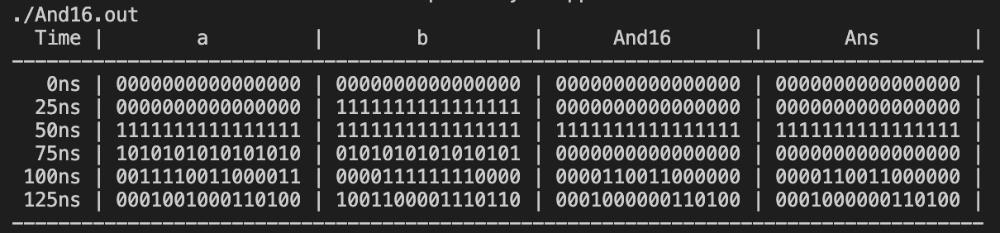

# **Not16**
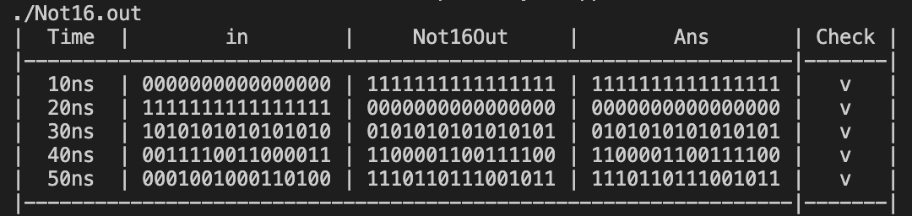

# **Or16**
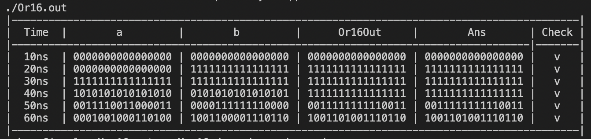

# **Mux16**
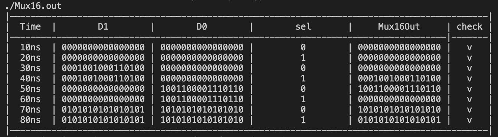

# **Or8Way**
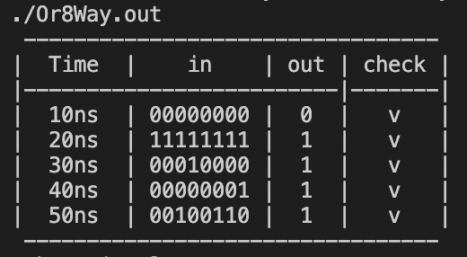

# **DMux4Way**
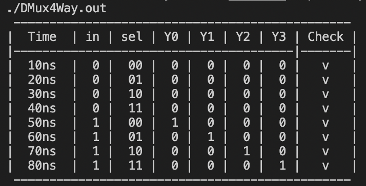

# DMux8Way**
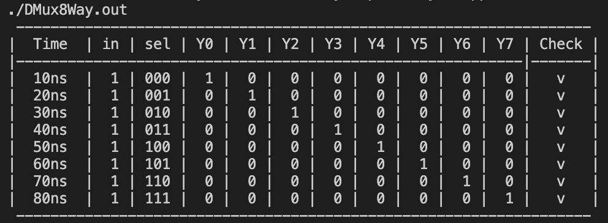

# **Mux4Way16**
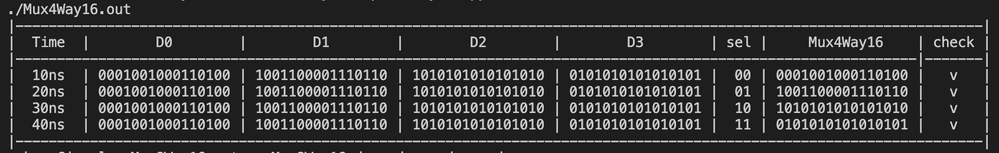

# **Mux8Way16**
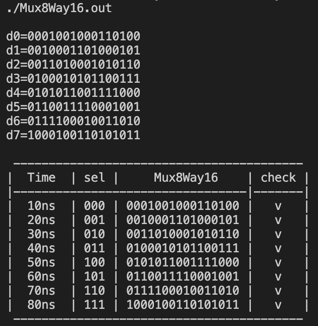